

  
  

  
  
  

<h3 align="center">
  <a href="https://github.com/Losif24/chimera-releases/releases/latest">⬇️ Descargar para Windows</a>
</h3>

Chimera es un entorno de escritorio para entender y mantener proyectos de software. Indexa el código, muestra cómo se relacionan sus archivos y te permite editarlo con esa información siempre a mano, para saber qué afecta a qué antes de tocar nada.

## Aplicaciones

| Aplicación | Descripción |
|---|---|
| **Launcher** | El punto de partida. Desde aquí abres las demás aplicaciones, gestionas tus proyectos y sus archivos, y recibes las actualizaciones. |
| **CODE** | Editor de código con los colores de un IDE: git en el margen, plegado de bloques, varios cursores, búsqueda y reemplazo en todo el proyecto, terminal integrada y un depurador de Python que explica cada error. |
| **ANÁLISIS** | Grafo interactivo de dependencias. Muestra las capas del proyecto, los ciclos, el impacto de cada cambio y el riesgo de cada archivo. |

## Visualización

<table>
  <tr>
    <td width="50%">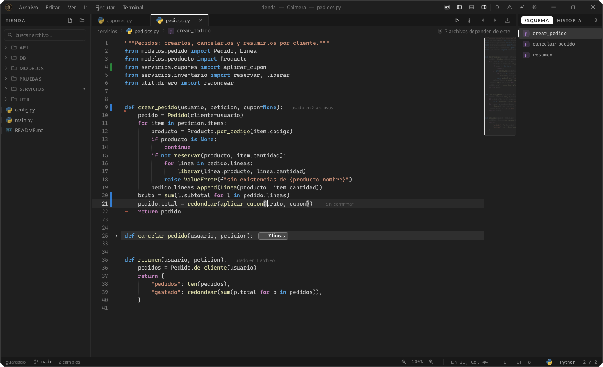
<b>CODE · editor con git, plegado y esquema</b>
</td>
    <td width="50%">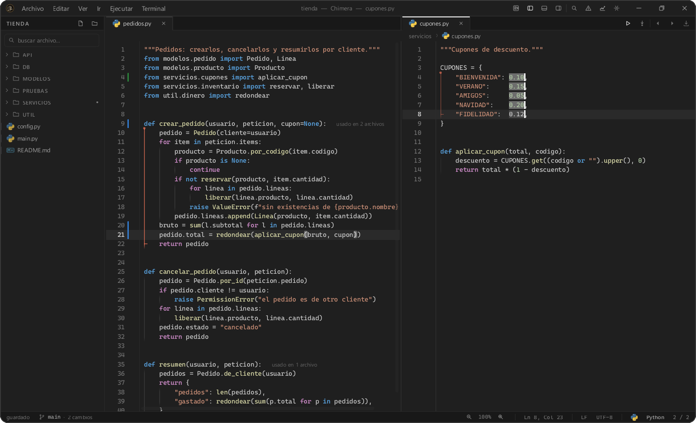
<b>CODE · dos archivos a la vez y selección en columna</b>
</td>
  </tr>
  <tr>
    <td width="50%">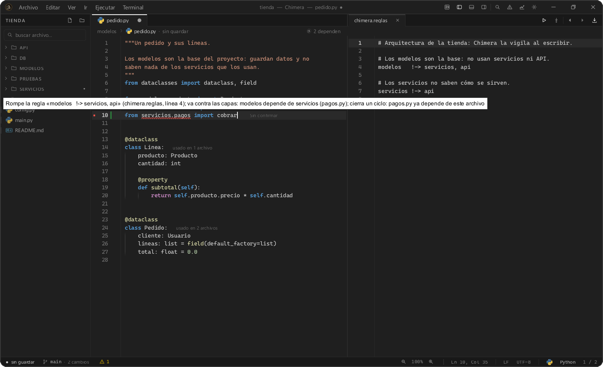
<b>CODE · avisa al escribir si rompes una regla del proyecto</b>
</td>
    <td width="50%">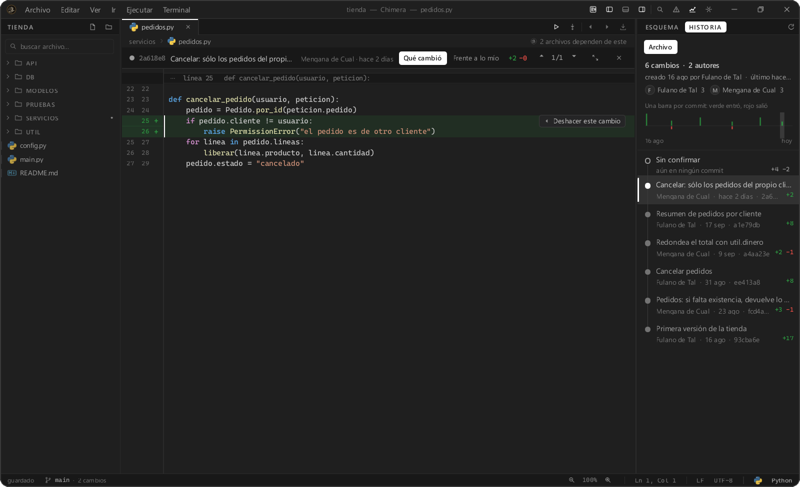
<b>CODE · la historia de cada archivo y qué cambió en cada commit</b>
</td>
  </tr>
  <tr>
    <td width="50%">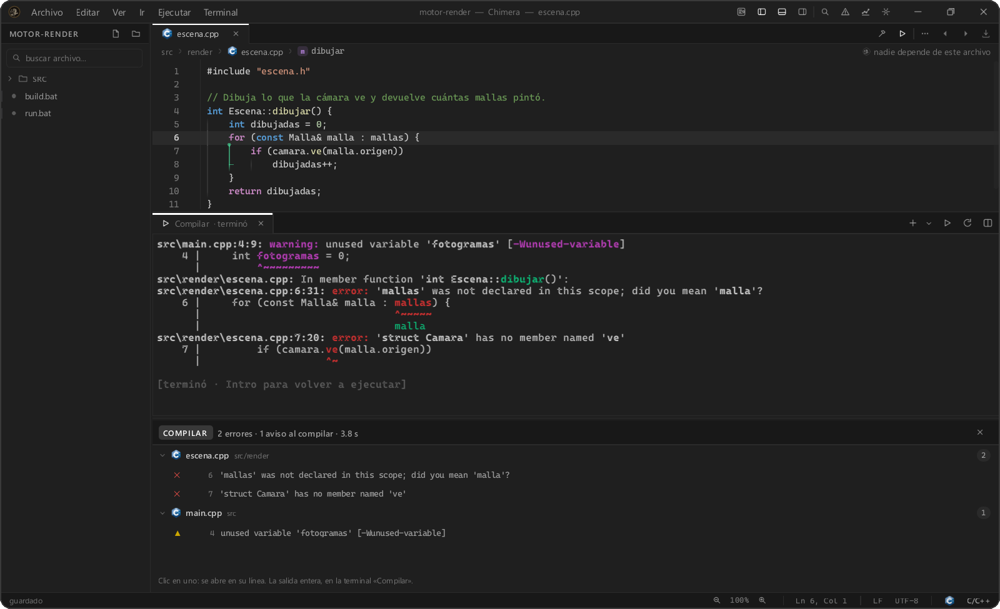
<b>CODE · compilar cualquier proyecto y saltar a cada error</b>
</td>
    <td width="50%">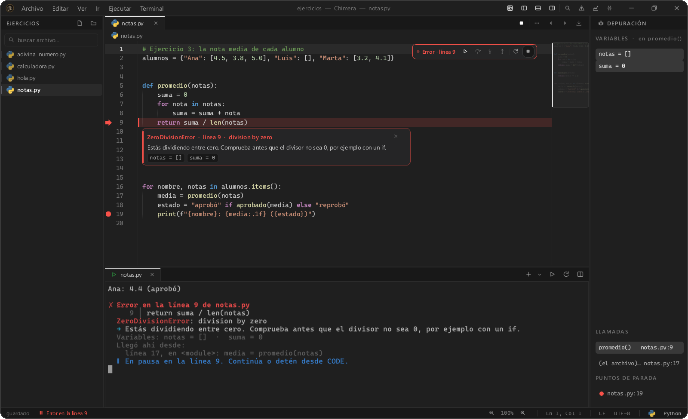
<b>CODE · ejecutar y depurar Python</b>
</td>
  </tr>
  <tr>
    <td width="50%">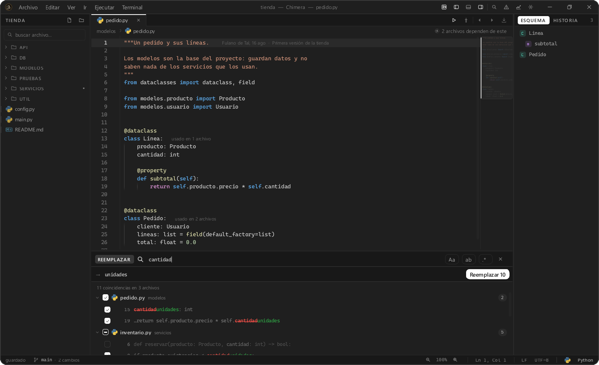
<b>CODE · buscar y reemplazar en todo el proyecto</b>
</td>
    <td width="50%">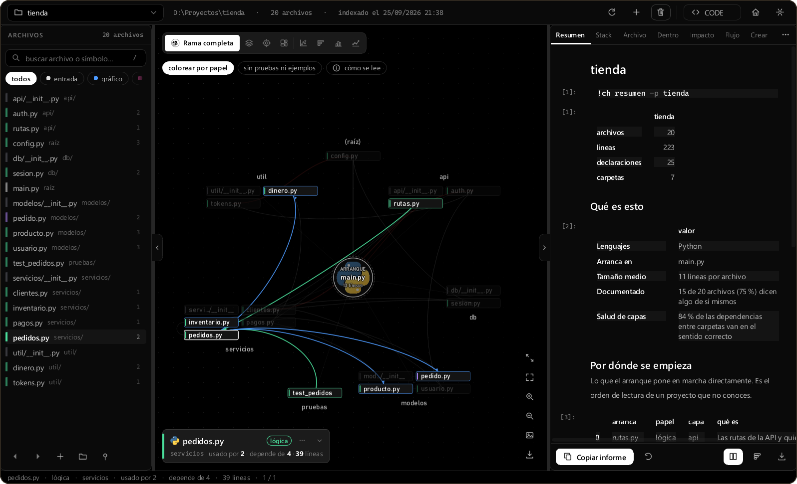
<b>ANÁLISIS · grafo de dependencias</b>
</td>
  </tr>
  <tr>
    <td width="50%">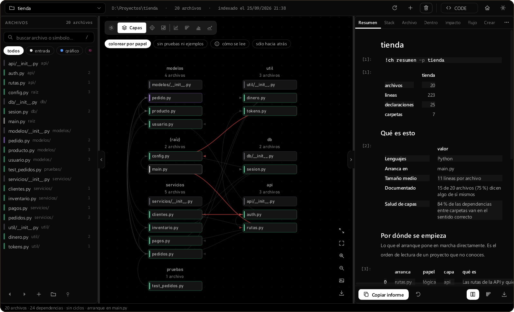
<b>ANÁLISIS · capas del proyecto: en rojo, lo que va contra la arquitectura</b>
</td>
    <td width="50%">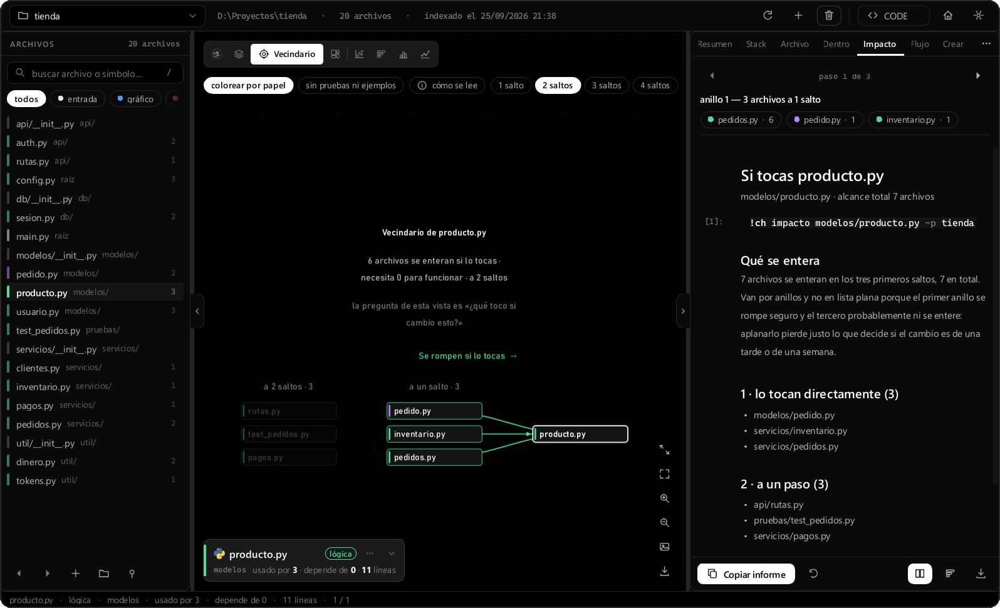
<b>ANÁLISIS · qué se rompe si tocas un archivo</b>
</td>
  </tr>
  <tr>
    <td width="50%">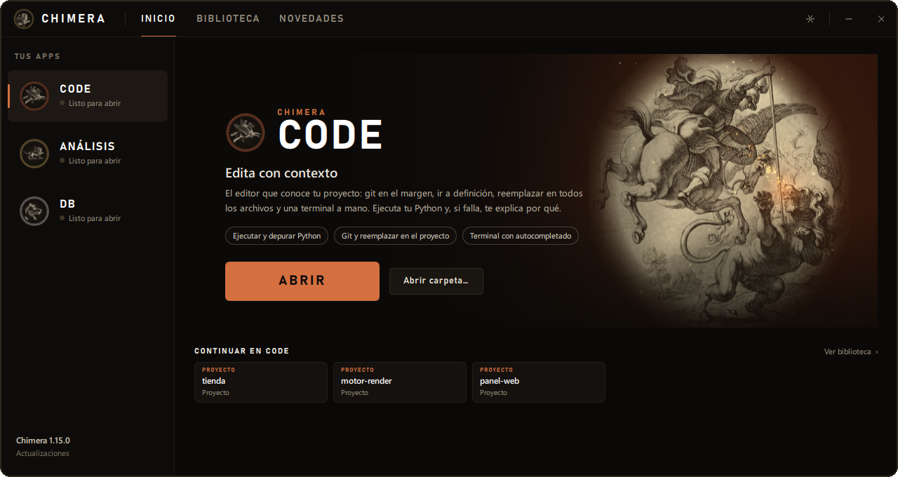
<b>Launcher</b>
</td>
    <td width="50%">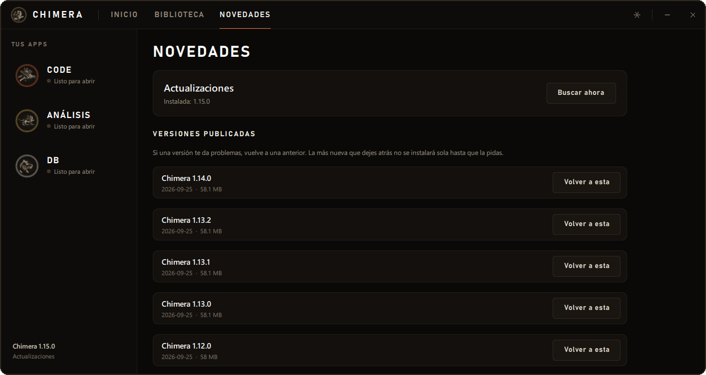
<b>Launcher · actualizaciones verificadas y vuelta a una versión anterior</b>
</td>
  </tr>
  <tr>
    <td width="50%">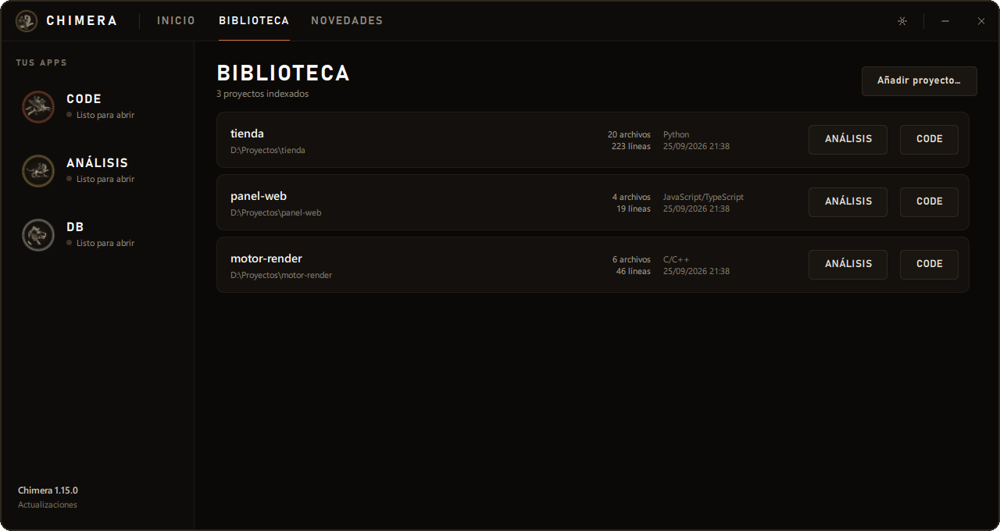
<b>Launcher · biblioteca de proyectos</b>
</td>
    <td width="50%">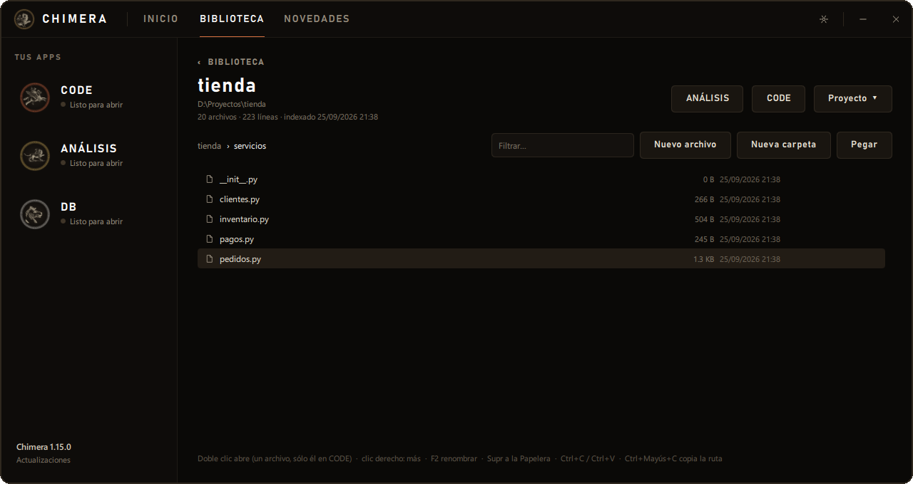
<b>Launcher · explorador de proyectos</b>
</td>
  </tr>
</table>

## Características

- **Apertura inmediata.** Con el launcher abierto, CODE se mantiene listo en segundo plano y los archivos se abren en menos de un segundo.
- **Integración con Windows.** Comandos `ch`, `ch-code` y `ch-an` disponibles en <kbd>Win</kbd> + <kbd>R</kbd> y en la terminal, además de accesos directos en el menú contextual del Explorador.
- **Gestión de proyectos.** Navega por los archivos de cada proyecto y renómbralos, cópialos o elimínalos sin salir del launcher.
- **Ejecutar y depurar Python.** <kbd>F5</kbd> ejecuta el archivo con el Python que ya tienes instalado e instala las librerías que falten. Si hay un error, se pausa en la línea y explica en español qué pasó; puntos de parada, paso a paso y variables a la vista.
- **Git y cambios grandes sin miedo.** Las líneas nuevas y cambiadas se marcan en el margen y se revierten con un clic; reemplazar en todo el proyecto enseña cada coincidencia antes de tocar nada y se puede deshacer.
- **Editor pensado para el día a día.** Plegado de bloques, varios cursores, visor de imágenes, sangría automática, cierre de paréntesis y comillas, guías de sangría, atajos configurables y guardado automático. La terminal se abre con <kbd>Ctrl</kbd> + <kbd>Mayús</kbd> + <kbd>Ñ</kbd>.
- **Informes exportables.** Resumen del proyecto, análisis de impacto, flujo de dependencias y un `MAPA.md` listo para incluir en el repositorio.
- **Actualizaciones verificadas.** Cada instalador se comprueba con su huella SHA-256 y siempre es posible volver a una versión anterior.

## Lenguajes compatibles

C/C++ · Python · C# · JavaScript · TypeScript · Java · Kotlin · Go · Rust · Swift · Dart · PHP · Ruby · QML

## Tecnologías

Python 3.13 · QML / Qt Quick (PySide6) · Inno Setup

## Instalación

1. Descarga la última versión de `ChimeraSetup-x.y.z.exe` desde [Releases](https://github.com/Losif24/chimera-releases/releases/latest).
2. Ejecuta el instalador. Chimera se instala para tu usuario en `%LOCALAPPDATA%\Programs\Chimera` y no requiere permisos de administrador.
3. A partir de ese momento, el launcher te avisará de cada nueva versión y se encargará de instalarla.

**Requisitos:** Windows 10 u 11 de 64 bits.

## Comandos

| Comando | Acción |
|---|---|
| `ch` | Abre el launcher |
| `ch-code .` · `ch-code archivo.py` | Abre CODE con la carpeta actual o solo con ese archivo |
| `ch-an .` · `ch-an MiProyecto` | Abre ANÁLISIS con ese proyecto |

---

Las ilustraciones proceden de grabados de dominio público: «Belerofonte mata a la Quimera», de Theodoor van Thulden según Rubens (1641, Rijksmuseum), y «Belerofonte en Pegaso» (1878). Desarrollado por Losif24.

